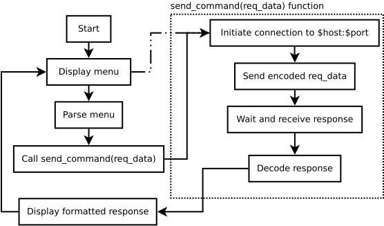

---
author:
- Ronggo Tsani Musyafa
- Rhazes Wahyu Ramadhan Setiawan
- Faiz Unisa Jazadi
colortheme: beaver
fontsize: 10
subtitle: Praktikum Sistem Komputer dan Jaringan
title: 'CPlan -- Proyek Implementasi Socket Programming'
---

# Ide

Kita ingin membuat aplikasi socket server (dan client) kalender sederhana.

# Protokol

## Daftar Agenda

$\rightarrow$ `list`

$\leftarrow$ daftar agenda (dipisahkan dengan newline) atau `EMPTY`

## Tambah Agenda

$\rightarrow$ `add <date:iso-8601> <event name>`

$\leftarrow$ `OK` or `ERROR`

## Hapus Agenda

$\rightarrow$ `del <date:iso-8601> <event name keyword>`

$\leftarrow$ `OK` or `ERROR`

# Model Koneksi

Model koneksi yang dipilih adalah satu koneksi digunakan untuk mengirim 1
perintah dan menerima 1 respon.

1.  Inisiasi koneksi
2.  $\rightarrow$ command
3.  $\leftarrow$ respon
4.  Koneksi ditutup

Model koneksi ini dipilih untuk alasan simplisitas -- tidak perlu memastikan
status koneksi di sisi client. Model koneksi ini juga lebih menghemat resource
pada server (client hanya membuka koneksi jika diperlukan).

# Database (Server)

Data agenda disimpan di file teks biasa dengan format tertentu.

Format: `<date:iso-8601> <nama agenda>`

    2022-11-10 Agenda 1
    2022-11-09 Agenda 2

Data disimpan dalam bentuk ini karena lebih sederhana dan mudah
diimplementasikan.

--------------------------------------------------------------------------------

# Implementasi

## Server

Dibangun menggunakan Python. Multi-threaded socket server dengan menggunakan
framework `socketserver` (bawaan Python).

## Client

Menggunakan Python dengan library `socket`.

# Implementasi Server

# Implementasi Server

--------------------------------------------------------------------------------

## Thank you

Demo time!
